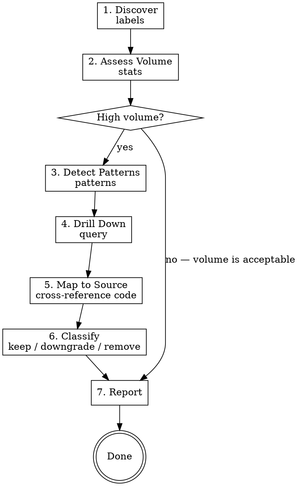

# Investigate Excessive Logs

## Overview

Systematic workflow for investigating excessive log volume from a service using `grafanactl`'s Loki integration. Identifies which log statements produce the most volume and produces actionable recommendations to keep, downgrade, or remove each one.

## When to Use

- "Which log lines are noisiest?" or "reduce our log volume"
- Service generating too many log lines, overwhelming Loki
- Loki storage costs too high — need to identify what's driving volume
- Need to identify noisy vs useful log statements before modifying log levels
- Pre-cleanup investigation before changing log levels or removing log statements
- Periodic log hygiene review

## Prerequisites

`grafanactl` must be configured with a context pointing to the target Grafana instance, and you must know the Loki datasource UID. Verify with:

```bash
grafanactl config current-context

# Discover Loki datasource UIDs via the Grafana API
# (grafanactl resources list does NOT list datasources — use the REST API directly)
curl -s -H "Authorization: Bearer $GRAFANA_TOKEN" \
  https://<grafana-server>/api/datasources | \
  python3 -c "import sys,json; [print(f'{d[\"uid\"]}  {d[\"name\"]}  ({d[\"type\"]})') for d in json.load(sys.stdin) if d['type']=='loki']"

# Confirm connectivity
grafanactl logs labels --datasource-uid <UID>   # should return label names
```

## Available Tools

Run `grafanactl help-tree logs` to see the full command surface:

```
grafanactl logs [--no-color] [-v|--verbose count]
  labels [--datasource-uid <datasource-uid>] [--from 1h] [--name <name>] [-o|--output text] [--to now]
  patterns [--datasource-uid <datasource-uid>] [--from 1h] [-o|--output text] [--selector <selector>] [--to now]
  query [--datasource-uid <datasource-uid>] [--direction backward] [--from 1h] [--limit int=100] [--logql <logql>] [-o|--output text] [--to now]
  stats [--datasource-uid <datasource-uid>] [--from 1h] [-o|--output text] [--selector <selector>] [--to now]
```

## Workflow



### Step 1: Discover — Confirm Target Exists in Loki

```bash
# List all available labels
grafanactl logs labels --datasource-uid <UID>

# Confirm the target namespace/app exists
grafanactl logs labels --datasource-uid <UID> --name namespace

# Check what apps/containers exist in the namespace
grafanactl logs labels --datasource-uid <UID> --name app
grafanactl logs labels --datasource-uid <UID> --name container
```

Record: available labels, target namespace/app name. This confirms the service's logs are being ingested into Loki and identifies the correct label selectors to use.

### Step 2: Assess Volume — Quantify the Problem

```bash
# Total log volume for the service (last 24h)
grafanactl logs stats --datasource-uid <UID> --selector '{namespace="myservice"}' --from 24h

# Compare with other namespaces for context
grafanactl logs stats --datasource-uid <UID> --selector '{namespace="other-service"}' --from 24h

# Machine-readable for further processing
grafanactl logs stats --datasource-uid <UID> --selector '{namespace="myservice"}' --from 24h -o json
```

> **Known limitation:** The Loki `/index/stats` endpoint only supports label matchers (stream selectors like `{namespace="x"}`). Pipeline stages like `| json | level="info"` will fail with "only label matchers are supported". To get level-specific volume, use `query` with client-side counting instead (see Step 4).

**Reading the output:**

| Column | Meaning |
|--------|---------|
| STREAMS | Number of unique log streams (label combinations) |
| CHUNKS | Number of storage chunks consumed |
| ENTRIES | Total number of log lines |
| BYTES | Total bytes of log data |

**Key signals:**
- High ENTRIES + high BYTES = lots of verbose log lines
- High STREAMS = many distinct label combinations (possible label cardinality issue)
- Compare with peer services to determine if volume is disproportionate

### Step 3: Detect Patterns — Find the Noisiest Log Lines

```bash
# Detect patterns across all logs for the service
grafanactl logs patterns --datasource-uid <UID> --selector '{namespace="myservice"}' --from 24h

# Detect patterns for info-level logs only
grafanactl logs patterns --datasource-uid <UID> --selector '{namespace="myservice"} | json | level="info"' --from 24h

# Wider time window for more stable pattern detection
grafanactl logs patterns --datasource-uid <UID> --selector '{namespace="myservice"}' --from 7d

# Machine-readable for sorting/filtering
grafanactl logs patterns --datasource-uid <UID> --selector '{namespace="myservice"}' --from 24h -o json
```

**Reading the output:**

Output is sorted by COUNT descending (highest volume first). Each row shows:

| Column | Meaning |
|--------|---------|
| COUNT | Total number of log lines matching this pattern |
| PATTERN | The detected log pattern with variable parts replaced by `<*>` |

**Key signals:**
- Top patterns by COUNT are the primary targets for reduction
- Patterns with `<*>` placeholders indicate variable content (IDs, timestamps, etc.)
- A single pattern accounting for >20% of total volume is a strong candidate for downgrade/removal
- Patterns that appear only in bursts may indicate retry loops or error cascades

> **Known limitation — patterns API can miss high-volume patterns:** Loki's pattern detection is heuristic and can significantly under-represent or completely miss major patterns. In one investigation, the #1 volume driver (69% of all logs) was NOT detected as a pattern at all. **Always verify** pattern results with `query` + client-side counting in Step 4. Compare the sum of all pattern counts to the `stats` total — a large gap means patterns are being missed.

### Step 4: Drill Down — Examine Actual Log Content

For each high-volume pattern from Step 3:

```bash
# See actual log lines matching a pattern fragment
grafanactl logs query --datasource-uid <UID> --logql '{namespace="myservice"} |= "pattern fragment"' --from 1h --limit 10

# Filter by log level
grafanactl logs query --datasource-uid <UID> --logql '{namespace="myservice"} | json | level="info" |= "pattern fragment"' --from 1h --limit 10

# See most recent lines first (default)
grafanactl logs query --datasource-uid <UID> --logql '{namespace="myservice"} |= "reconciliation"' --from 1h --limit 20 --direction backward

# See oldest lines first (useful for understanding sequences)
grafanactl logs query --datasource-uid <UID> --logql '{namespace="myservice"} |= "reconciliation"' --from 1h --limit 20 --direction forward
```

> **Known limitation — negative line filters (`!=`, `!~`) are broken through the Grafana datasource proxy.** Queries like `{ns="x"} != "noisy message"` will fail with a Loki parse error because the Grafana proxy mangles the `!` character in query parameters. This affects both GET and POST requests. **Workaround:** use only positive filters (`|=`, `|~`) and do exclusion client-side.

#### Client-Side Message Counting

Since `stats` doesn't support pipeline filters and `patterns` can miss patterns, use `query -o json` with client-side counting to get accurate message distributions:

```bash
# Fetch a large sample and count by message field
grafanactl logs query --datasource-uid <UID> \
  --logql '{namespace="myservice"}' \
  --from 1h --limit 5000 -o json | \
  python3 -c "
import sys, json
from collections import Counter
data = json.load(sys.stdin)
msgs = Counter()
for entry in data:
    try:
        parsed = json.loads(entry['line'])
        msgs[parsed.get('msg', '<no msg>')] += 1
    except: msgs['<non-json>'] += 1
for msg, count in msgs.most_common(20):
    pct = count / len(data) * 100
    print(f'{count:>6} ({pct:5.1f}%)  {msg}')
"
```

This technique is essential for:
- Getting accurate log level distribution (% INFO vs DEBUG vs ERROR)
- Finding the actual top messages when patterns API misses them
- Estimating per-message volume by extrapolating from the sample ratio against `stats` totals

Look for:
- **Repetitive content**: Same message with only IDs/timestamps changing → candidate for DOWNGRADE
- **High-frequency lifecycle events**: "starting reconciliation", "finished reconciliation" → candidate for DOWNGRADE
- **Kubernetes watch events**: "received Add event", "received Update event" → candidate for DOWNGRADE
- **Valuable operational signals**: Errors, warnings, state changes → candidate for KEEP
- **Redundant information**: Same fact logged in multiple places → candidate for REMOVE

### Step 5: Map to Source — Cross-Reference with Code

For each high-volume pattern identified in Steps 3-4, find the corresponding log statement in the source code:

1. Search for distinctive string fragments from the pattern in the codebase
2. Note the file path, line number, and log level
3. Understand the calling context (how often is this code path executed?)
4. Check if the log statement includes useful structured fields or just noise

```bash
# Example: search for a log message fragment in the service codebase
grep -rn "received Add event" /path/to/service/
grep -rn "starting reconciliation" /path/to/service/
```

Build a mapping table:

| Pattern | Source File | Line | Context | Volume |
|---------|------------|------|---------|--------|
| `received Add event for <*>` | `pkg/watchers/watcher.go` | 43 | K8s watch handler | HIGH |
| `starting reconciliation for <*>` | `pkg/engine/reconciler.go` | 131 | Reconcile loop | MEDIUM |

### Step 6: Classify — Determine Action for Each Log Statement

Assign each log statement to a category:

| Category | Criteria | Action |
|----------|----------|--------|
| **KEEP** | Essential operational visibility, low volume, or required for incident response | Leave as Info |
| **DOWNGRADE** | Useful for debugging but too frequent at Info level; moving to Debug eliminates it from default production logging | Change to Debug |
| **REMOVE** | No value even for debugging, redundant with other logs, or pure noise | Delete the log statement |

**Classification guidelines:**
- **Startup/shutdown messages**: Usually KEEP (low volume, high value for incident response)
- **Per-request/per-event lifecycle logs**: Usually DOWNGRADE (useful for debugging, too noisy for production)
- **Kubernetes watch event logs**: Usually DOWNGRADE (extremely high volume in busy clusters)
- **Pagination/iteration logs**: Usually DOWNGRADE or REMOVE (internal implementation detail)
- **Validation success logs**: Usually DOWNGRADE (only failures are interesting at Info)
- **Duplicate information**: REMOVE the redundant one, KEEP or DOWNGRADE the canonical one

### Step 7: Report — Produce Recommendations

Produce a structured report with:

1. **Executive Summary**: Total log volume, info-level percentage, top 5 patterns by volume, estimated reduction
2. **Per-File Analysis**: For each source file containing info-level logs:
   - File path and purpose
   - Each log statement with: line number, current level, detected pattern, volume, classification, rationale
3. **Specific Code Changes**: Exact line numbers and replacement code for DOWNGRADE and REMOVE recommendations
4. **Estimated Volume Reduction**: Calculate expected reduction based on pattern counts
   - Sum of DOWNGRADE pattern counts = lines eliminated from info-level output
   - Sum of REMOVE pattern counts = lines eliminated entirely
   - Express as percentage of current info-level volume

## Quick Reference

| Task | Command |
|------|---------|
| List available labels | `grafanactl logs labels --datasource-uid <UID>` |
| List values for a label | `grafanactl logs labels --datasource-uid <UID> --name <label>` |
| Get log volume stats | `grafanactl logs stats --datasource-uid <UID> --selector '{ns="x"}'` |
| Detect high-volume patterns | `grafanactl logs patterns --datasource-uid <UID> --selector '{ns="x"}'` |
| Query specific log lines | `grafanactl logs query --datasource-uid <UID> --logql '{ns="x"} \|= "text"'` |
| Query with limit | `grafanactl logs query --datasource-uid <UID> --logql '{ns="x"}' --limit 50` |
| Wider time window (any cmd) | append `--from 24h` or `--from 7d` |
| JSON output (any command) | append `-o json` |
| Discover Loki datasource UID | `curl -s -H "Authorization: Bearer $TOKEN" https://<server>/api/datasources \| python3 -c "..."` (see Prerequisites) |
| Client-side message counting | `grafanactl logs query ... -o json \| python3 -c "..."` (see Step 4) |

## Known LogQL Limitations (via Grafana Datasource Proxy)

These limitations apply when querying Loki through Grafana's datasource proxy (which is how `grafanactl` works). They do NOT apply when querying Loki directly.

1. **Negative line filters (`!=`, `!~`) fail.** The Grafana datasource proxy mangles the `!` character in URL-encoded query parameters, causing Loki parse errors. Use positive filters (`|=`, `|~`) and do exclusion client-side.

2. **`/index/stats` only supports label matchers.** You cannot use pipeline stages (`| json | level="info"`) with the stats endpoint. Only stream selectors like `{namespace="x"}` are accepted. Use `query` + client-side counting for filtered volume estimates.

3. **Patterns API can miss high-volume patterns.** Loki's pattern detection is heuristic. In practice, it can completely miss the highest-volume log message. Always cross-check by comparing the sum of pattern counts to the `stats` total, and verify with `query` + client-side counting.

4. **`query` is capped at 5000 entries.** The `--limit` flag maxes out at 5000 per request. For volume estimation, sample 5000 entries, compute message ratios, then extrapolate against `stats` totals.

## Common Mistakes

- **Too short analysis window**: 1h (the default) may miss patterns that only appear during peak hours. Start with `--from 24h`, extend to `--from 7d` for more representative data.
- **Skipping the stats step**: Jumping straight to patterns without first quantifying total volume means you lack context for how significant each pattern is. Always get total stats first.
- **Trusting patterns API blindly**: The patterns API can miss entire high-volume patterns. Always verify with `query` + client-side counting. Compare sum of pattern counts to `stats` totals — a large gap (e.g., patterns sum to 2M but stats show 30M) means major patterns are being missed.
- **Using negative filters (`!=`, `!~`)**: These fail through the Grafana datasource proxy. Use positive filters (`|=`) and exclude client-side instead.
- **Trying `stats` with pipeline filters**: `stats` only accepts label matchers. `{ns="x"} | json | level="info"` will error. Use `query` + client-side counting for filtered volume.
- **Matching patterns too literally**: Loki's pattern detection uses `<*>` for variable parts. Don't try to match the exact pattern string — extract a distinctive static fragment and use `|=` in queries.
- **Recommending removal without context**: Always read the source code around the log statement. A log line that looks noisy might be the only signal for a critical code path. Check the calling context before classifying.
- **Ignoring structured fields**: A log line like `"reconciliation complete" duration=1.2s items=50` carries valuable metrics in its fields. Consider whether the structured data is used by dashboards or alerts before downgrading.
- **Not comparing with peer services**: A service logging 1M lines/day sounds high, but if peer services log 5M lines/day, it may be normal. Use stats on multiple namespaces for baseline comparison.
- **Forgetting the datasource UID**: Every logs command requires `--datasource-uid`. Discover it once at the start with `curl` against the Grafana `/api/datasources` endpoint and reuse throughout.
