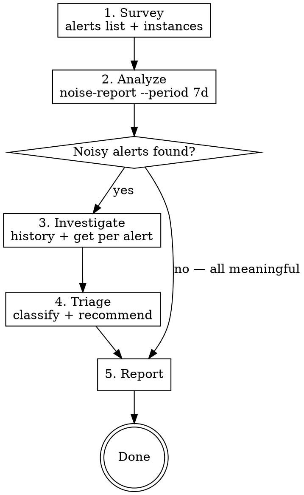

# Investigate Noisy Alerts

## Overview

Systematic workflow for triaging Grafana alerts using `grafanactl`. Identifies which firing alerts are noisy (flapping, low-value) vs meaningful (real problems) and produces actionable recommendations.

## When to Use

- "Which alerts are noisy?" or "triage our alerts"
- Alert fatigue — too many alerts firing, team ignoring them
- Flapping alerts — alerts rapidly cycling between firing and resolved
- Pre-cleanup investigation before silencing or deleting alert rules
- Periodic alert hygiene review

## Prerequisites

`grafanactl` must be configured with a context pointing to the target Grafana instance. Verify with:

```bash
grafanactl config current-context
grafanactl alerts list   # should return alert rules
```

## Available Tools

Run `grafanactl help-tree alerts` to see the full command surface:

```
grafanactl alerts [--no-color] [-v|--verbose count]
  export [--folder-uid <folder-uid>] [--format yaml] [--group <group>] [--rule-uid <rule-uid>]
  get UID [-o|--output json]
  history [--from 24h] [--limit int=1000] [-o|--output text] [--to now]
  instances [-o|--output text] [--state <state>]
  list [-o|--output text] [--state <state>]
  noise-report [-o|--output text] [--period 7d] [--threshold int=5]
  search [--name <name>] [-o|--output text]
```

## Workflow



### Step 1: Survey — Understand the Current State

```bash
# What's currently firing?
grafanactl alerts list --state firing

# How many instances per rule? What labels are involved?
grafanactl alerts instances

# Total alert rule count for context
grafanactl alerts list -o json | jq length
```

Record: total rules, firing count, instance count. This frames the investigation scope.

### Step 2: Analyze — Run Noise Report

```bash
# Default: 7-day window, threshold of 5 fires
grafanactl alerts noise-report

# Wider window for seasonal patterns
grafanactl alerts noise-report --period 30d

# Lower threshold to catch borderline cases
grafanactl alerts noise-report --period 7d --threshold 3

# Machine-readable for further processing
grafanactl alerts noise-report -o json
```

**Reading the output:**

| Column | Meaning |
|--------|---------|
| FIRES | Times alert transitioned to firing state |
| RESOLVES | Times alert transitioned to resolved state |
| AVG_DURATION | Mean time spent firing per episode |
| CLASSIFICATION | `noisy` (fires > threshold) or `meaningful` |

**Key signals:**
- High FIRES + high RESOLVES + short AVG_DURATION = flapping (noisy)
- High FIRES + low RESOLVES = stuck firing repeatedly without resolving
- Low FIRES + long AVG_DURATION = sustained, likely meaningful
- FIRES = 0 = never fired in the period (consider removing or the period is too short)

### Step 3: Investigate — Drill Into Noisy Alerts

For each alert classified as noisy:

```bash
# See the state transition timeline
grafanactl alerts history --from 7d | grep "AlertName"

# Get the rule configuration to understand thresholds
grafanactl alerts get <UID>
grafanactl alerts get <UID> -o yaml

# Export for review or modification
grafanactl alerts export --rule-uid <UID>
```

Look for:
- **Threshold too tight**: firing at minor deviations
- **No `for` duration**: fires instantly on threshold breach instead of requiring sustained breach
- **Missing labels/grouping**: separate instances that should be aggregated
- **Noisy data source**: underlying metric is inherently volatile

### Step 4: Triage — Classify and Recommend

Assign each noisy alert to a category:

| Category | Criteria | Action |
|----------|----------|--------|
| **Silence** | Fires frequently, no one acts on it, low business impact | Mute or delete the rule |
| **Tune** | Fires too often but tracks a real signal | Adjust threshold, add `for` duration, or reduce evaluation frequency |
| **Aggregate** | Many instances firing for same root cause | Add grouping labels or consolidate rules |
| **Restructure** | Alert concept is valid but implementation is wrong | Rewrite the query or change the condition logic |
| **Keep** | Fires often but each fire is actionable | Leave as-is, it's doing its job |

### Step 5: Report

Produce a summary with:

1. **Scope**: total rules, firing count, analysis period
2. **Noisy alerts table**: name, UID, fire count, classification, recommended action
3. **Meaningful alerts table**: name, UID, fire count, current state
4. **Recommendations**: prioritized list of changes ordered by impact

## Quick Reference

| Task | Command |
|------|---------|
| List all firing alerts | `grafanactl alerts list --state firing` |
| See firing instances with labels | `grafanactl alerts instances` |
| Run noise analysis (7d default) | `grafanactl alerts noise-report` |
| Noise analysis with custom period | `grafanactl alerts noise-report --period 30d` |
| View state change timeline | `grafanactl alerts history --from 7d` |
| Get rule config by UID | `grafanactl alerts get <UID>` |
| Export rule for editing | `grafanactl alerts export --rule-uid <UID>` |
| Search rules by name | `grafanactl alerts search --name "pattern"` |
| JSON output (any command) | append `-o json` |

## Common Mistakes

- **Too short analysis period**: 24h may miss weekly patterns. Start with 7d, extend to 30d if needed.
- **Ignoring threshold setting**: Default threshold of 5 may be too high or low for your environment. A team with 500 alerts may need `--threshold 10`; a small setup may need `--threshold 3`.
- **Only looking at fire count**: An alert that fires 6 times but each fire lasts 8 hours is meaningful. Check AVG_DURATION alongside FIRES.
- **Not checking instances**: A rule might fire once but produce 50 instances across different label sets. Use `grafanactl alerts instances` to see the full picture.
- **Recommending deletion without context**: Always `grafanactl alerts get <UID>` to understand the rule's intent before recommending removal.
